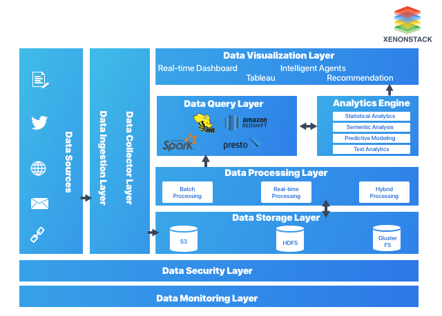
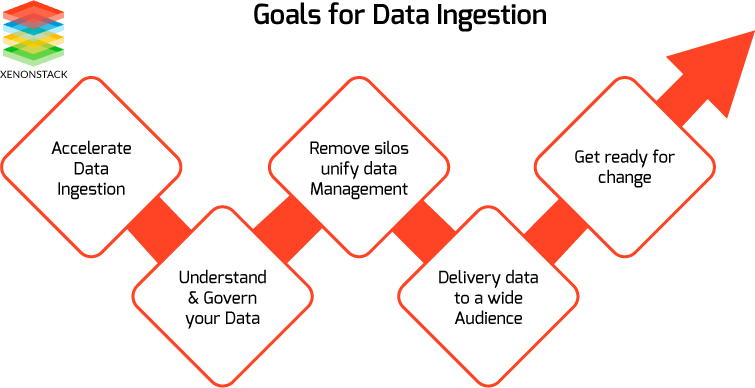
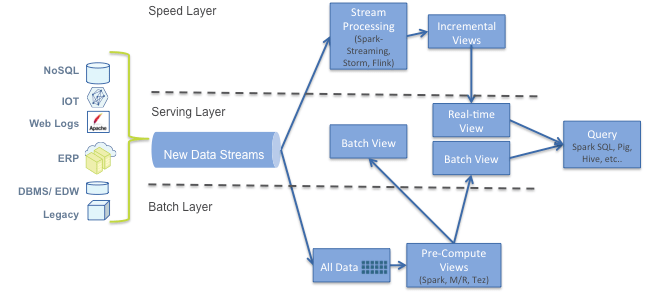
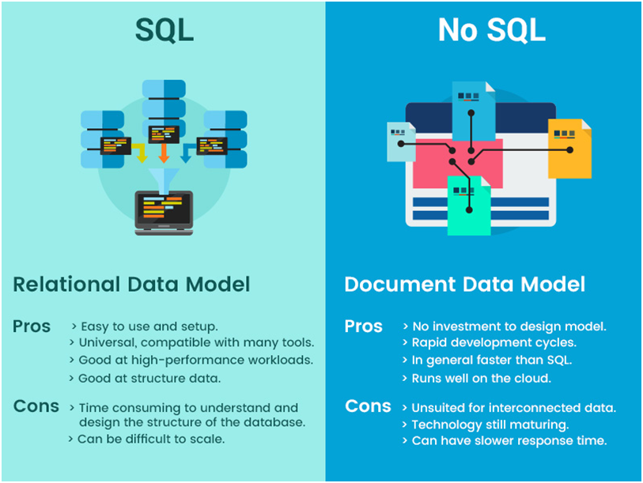
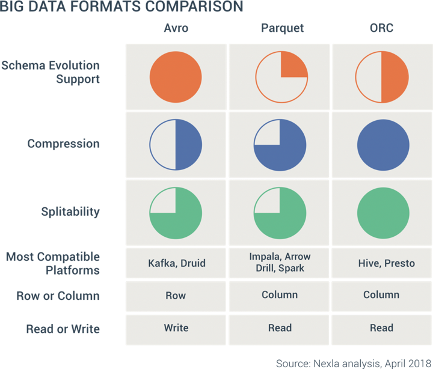

### What is CAP Theorem
Cap Theorem was developed by Eric Brewer at Berkeley University in the 2000s.

He argues that it’s impossible that a distributed computer system can provide the 3 following properties at a time:

* Consistency: When performing an operation you always have to receive the same information, regardless of the node that processes the order. It means that no matter which node that forms our Database receives an order, everyone must respond to the operation equally and must be transparent to us who effected it. All clients see the same version of data.
* Availability: the system provides answers for all requests it receives, even if one or more nodes are down.
* Tolerance to divisions:the system still Works even though it has been divided by a network failure.
  

The CAP theorem states that it is not possible to guarantee all three of the desirable properties – consistency, availability, and partition tolerance at the same time in a distributed system with data replication.

### The main difference between scaling up and scaling out is that 
* `Horizontal scaling` : Adds more machine resources to your existing machine infrastructure. 
* `Vertical scaling` : Adds power to your existing machine infrastructure by increasing power from CPU or RAM to existing machines.

### What exactly is big data?
The definition of big data is data that contains greater variety, arriving in increasing volumes and with more velocity. This is also known as the three Vs.

Two more Vs have emerged over the past few years: value and veracity. Data has intrinsic value. But it’s of no use until that value is discovered. Equally important: How truthful is your data—and how much can you rely on it?

* Storage services: HDFS (Hadoop Distributed File System)
* Processing services : MapReduce , Apache Spark, Apache Flink
* Data Warehousing services : Apache Hive
* Orchestrating services : Oozie, Airflow
* Stream processing Service : Spark Streaming, Kafka
* ETL(Extract-Transform-Load) Service : Apache NiFi
* Co-ordinating services : Zookeeper
* Security Services : Ranger, Kerberos
* NoSQL store : HBase

### Big data benefits:
* Big data makes it possible for you to gain more complete answers because you have more information.
* More complete answers mean more confidence in the data—which means a completely different approach to tackling problems.

### Big Data challenges ?
* **Complexity** Organizations still struggle to keep pace with their data and find ways to effectively store it.
* **Skillset** Clean data, or data that’s relevant to the client and organized in a way that enables meaningful analysis, requires a lot of work. Data scientists spend 50 to 80 percent of their time curating and preparing data before it can actually be used.
* **Technology maturity** Finally, big data technology is changing at a rapid pace. A few years ago, Apache Hadoop was the popular technology used to handle big data. Then Apache Spark was introduced in 2014. Today, a combination of the two frameworks appears to be the best approach. Keeping up with big data technology is an ongoing challenge.
* **Security** Big data solutions usually rely on storing all static data in a centralized data lake. Securing access to this data can be challenging, especially when the data must be ingested and consumed by multiple applications and platforms.

### What is the Architectural Pattern of Big Data?
* Data Ingestion Layer
* Data Collector Layer
* Data Processing Layer
* Data Storage Layer
* Data Query Layer
* Data Visualization Layer

### Big data architecture style ..?

Big data solutions typically involve one or more of the following types of workload:
* Batch processing of big data sources at rest.
* Real-time processing of big data in motion.
* Interactive exploration of big data.
* Predictive analytics and machine learning.

### Why we need Data Pipeline?
To process large amounts of real-time or streaming data requires you to build a data processing pipeline. The main challenge in building such a pipeline is to minimize latency & achieve near real-time processing rate to process high-throughput data.
* Convert incoming data to a common format.
* Prepare data for Analysis and Visualization.
* Migrate between Databases.
* Share Data Processing logic across Web Apps, Batch Jobs, and APIs.
* Power your Data Ingestion and Integration tools.

#### What is expectations from Real Time Data Ingestion framework.?
* Quick Response
* Replayability
* Reliability
* Scalability
* Ease of Integration
* Ease of Switching
* Capturing Schema Changes

#### What are the goal of Data Ingestion framework .?

### What is the Lambda Architecture :
Lambda architecture is a data-processing architecture designed to handle massive quantities of data by taking advantage of both `Batch` and `Realtime Stream Processing` methods. 
This approach to architecture attempts to balance latency, throughput, and fault-tolerance by using batch processing to provide comprehensive and accurate views 
of batch data, while simultaneously using real-time stream processing to provide views of online data.

### What is the Kappa Architecture :
A drawback to the lambda architecture is its complexity. Processing logic appears in two different places — the cold and hot paths — using different frameworks. This leads to duplicate computation logic and the complexity of managing the architecture for both paths.

The kappa architecture was proposed by `Jay Kreps` as an alternative to the lambda architecture. It has the same basic goals as the lambda architecture, but with an important distinction: All data flows through a single path, using a stream processing system.

There are some similarities to the lambda architecture's batch layer, in that the event data is immutable and all of it is collected, instead of a subset. The data is ingested as a stream of events into a distributed and fault tolerant unified log. These events are ordered, and the current state of an event is changed only by a new event being appended. Similar to a lambda architecture's speed layer, all event processing is performed on the input stream and persisted as a real-time view.

If you need to recompute the entire data set (equivalent to what the batch layer does in lambda), you simply replay the stream, typically using parallelism to complete the computation in a timely fashion.

#### How to generate Live Report with last 20 yr of Data.

#### When We should go for No Sql Database

The structure of many different forms of data is more easily handled and evolved with a NoSQL database. 
NoSQL databases are often better suited to storing and modeling structured, semi-structured, 
and unstructured data in one database.

#### What are different Big Data formats ..?

### Which compression to choose
Not writing ORC files in compression results in larger disk space and slower in performance. Hence, it is suggestable to use compression. Below are basic comparison between ZLIB and SNAPPY when to use what.

When you need a faster read then ZLIB compression is to-go option, without a doubt, It also takes smaller storage on disk compared with SNAPPY.
ZLIB is slightly slower in write compared with SNAPPY. If you have large data set to write, use SNAPPY. For smaller datasets, it is still suggestible to use ZLIB.

### Spark Data Skewness ..?
