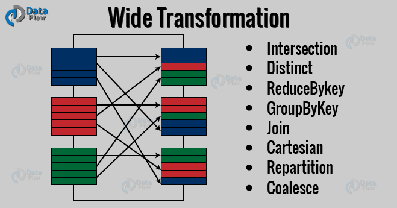

### hdfs dfs -ls -R

### hdfs dfs -put <source> <destination>

-put [-f] [-p] [-l] <localsrc> … <dst> :
Copy files from the local file system into fs. Copying fails if the file already
exists, unless the -f flag is given.

Flags:
-p  Preserves access and modification times, ownership and the mode.
-f  Overwrites the destination if it already exists.
-l  Allow DataNode to lazily persist the file to disk. Forces
         replication factor of 1. This flag will result in reduced
         durability. Use with care.

### hdfs -du -s -h /path/to/dir

spark-submit --jars myjar.jar \
--driver-class-path myjar.jar \
--conf spark.executor.extraClassPath=myjar.jar \
--class SampleApplication my-application.jar

### hadoop distcp hdfs://namenode:port/source hdfs://namenode:port/destination
