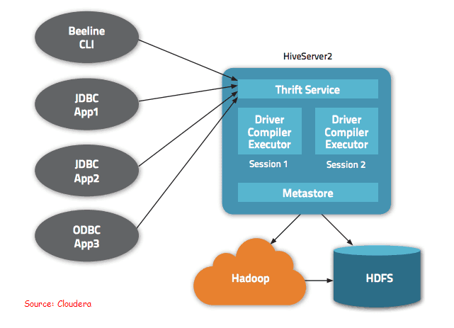

### What are the different components of a Hive architecture?
There are several components of Hive Architecture. Such as –

* `User Interface –` Basically, it calls the execute interface to the driver. Further, driver creates a session handle to the query. Then sends the query to the compiler to generate an execution plan for it.
* `Metastore –` It is used to Send the metadata to the compiler. Basically, for the execution of the query on receiving the send MetaData request.
* `Compiler-` It generates the execution plan. Especially, that is a DAG of stages where each stage is either a metadata operation, a map or reduce job or an operation on HDFS.
* `Execute Engine-` Basically,  by managing the dependencies for submitting each of these stages to the relevant components we use Execute engine.


## Overview
Understand the meaning of partitioning and bucketing in the Hive in detail.
We will see, how to create partitions and buckets in the Hive


### Introduction
You might have seen an encyclopedia in your school or college library. It is a set of books that will give you information about almost anything. Do you know what is the best thing about the encyclopedia?

### Partitioning vs Bucketing
Yes, you guessed it correctly. The words are arranged alphabetically.  For example, you have a word in mind  “Pyramids”. You will directly go and pick up the book with the title “P”. You don’t have to search that in other books. Can you imagine how tough would the task be to search for a single book if they were stored without any order?
Here storing the words alphabetically represents indexing, but using a different location for the words that start from the same character is known as bucketing.
Similar kinds of storage techniques like partitioning and bucketing are there in Apache Hive so that we can get faster results for the search queries. In this article, we will see what is partitioning and bucketing, and when to use which one?

### Table of Contents
* What is Partitioning?
* When to use Partitioning?
* What is Bucketing?
* When to use Bucketing?

#### What is Partitioning?
Apache Hive allows us to organize the table into multiple partitions where we can group the same kind of data together. It is used for distributing the load horizontally. Let’s understand it with an example:

Suppose we have to create a table in the hive which contains the product details for a fashion e-commerce company. It has the following columns:

Data

Now, the first filter that most of the customer uses is Gender then they select categories like Shirt, its size, and color. Let’s see how to create the partitions for this example.
```
CREATE TABLE products ( product_id string,
brand      string,
size       string,
discount   float,
price      float )
PARTITIONED BY (gender string,
category string,
color string);
```
Now, the hive will store the data in the directory structure like:
```
/user/hive/warehouse/mytable/gender=male/category=shoes/color=black
```


Partitioning the data gives us performance benefits and also helps us in organizing the data. Now, let’s see when to use the partitioning in the hive.


#### When to use Partitioning?
* When the column with a high search query has low cardinality. For example, if you create a partition by the country name then a maximum of 195 partitions will be made and these number of directories are manageable by the hive.
* On the other hand, do not create partitions on the columns with very high cardinality. For example- product IDs, timestamp, and price because will create millions of directories which will be impossible for the hive to manage.
* It is effective when the data volume in each partition is not very high. For example, if you have the airline data and you want to calculate the total number of flights in a day. In that case, the result will take more time to calculate over the partition “Dubai” as it has one of the busiest airports in the world whereas for the country like “Albania” will return results quicker.


#### What is Bucketing?
In the above example, we know that we cannot create a partition over the column price because its data type is float and there is an infinite number of unique prices are possible.

Hive will have to generate a separate directory for each of the unique prices and it would be very difficult for the hive to manage these. Instead of this, we can manually define the number of buckets we want for such columns.


In bucketing, the partitions can be subdivided into buckets based on the hash function of a column. It gives extra structure to the data which can be used for more efficient queries.
```
CREATE TABLE products ( product_id string,
brand string,
size string,
discount float,
price float )
PARTITIONED BY (gender string,
category string,
color string)
CLUSTERED BY (price) INTO 50 BUCKETS;
```
Now, only 50 buckets will be created no matter how many unique values are there in the price column. For example, in the first bucket, all the products with a price [ 0 – 500 ] will go, and in the next bucket products with a price [ 500 – 200 ] and so on.

In bucketing, the partitions can be subdivided into buckets based on the hash function of a column. It gives extra structure to the data which can be used for more efficient queries.
Now, only 50 buckets will be created no matter how many unique values are there in the price column. For example, in the first bucket, all the products with a price [ 0 – 500 ] will go, and in the next bucket products with a price [ 500 – 200 ] and so on.


### When to use Bucketing?
* We cannot do partitioning on a column with very high cardinality. Too many partitions will result in multiple Hadoop files which will increase the load on the same node as it has to carry the metadata of each of the partitions.
* If some map-side joins are involved in your queries, then bucketed tables are a good option. Map side join is a process where two tables are joins using the map function only without any reduced function. I would recommend you to go through this article for more understanding about map-side joins: Map Side Joins in Hive
* It allows us to decrease the query time. Also, makes the sampling process more efficient.

### Explain Static Vs Dynamic Partitioning in Hive 
 * `Static Partitioning`  : At the time of data load. Ex. Daily Data load.
 * `Dynamic Partitioning` : At the time of SQL Join & Data Insertions 
 Dynamic partitioning can be enable by adding following  configuration .
hive.exec.dynamic.partition=true
hive.exec.dynamic.partition.mode=nonstrict

### What is the Lateral View ?
Explode function displays each element of collection data type as single row.
```
CREATE TABLE Products (
 id INT, 
 ProductName STRING, 
 ProductColorOptions ARRAY<STRING>
);

select * from products;

1 Watches [“Red”,”Green”]
2 Clothes [“Blue”,”Green”]
3 Books [“Blue”,”Green”,”Red”]

```
#
```
select explode(ProductColorOptions ) from products;
Red
Green
```
But I want to join with other columns like id but that leads to an error.
In that case, we need to use Lateral View.Lateral view creates a virtual table for exploded columns and make join with the base table.
We need not worry about the virtual table as it is done by hive internally.
```
SELECT p.id,p.productname,colors.colorselection FROM default.products P
LATERAL VIEW EXPLODE(p.productcoloroptions) colors as colorselection;
1 Watches Red
1 Watches Green
2 Clothes Blue
```

### What is the Accumulative SUM in Hive ?
```hive
1 JAN-2021  1000$
2 JAN-2021  2000$
3 FEB-2021  500$
4 MAR-2021  350$
5 MAR-2021  500$

to 

1 JAN-2021  1000$
2 JAN-2021  3000$
3 FEB-2021  500$
4 MAR-2021  350$
5 MAR-2021  850$
```
