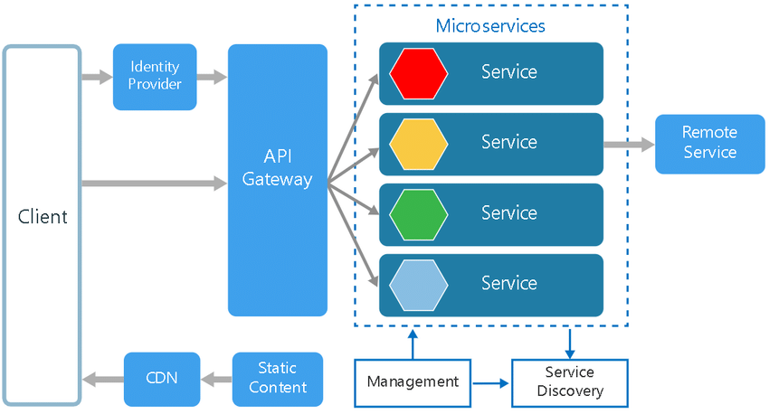
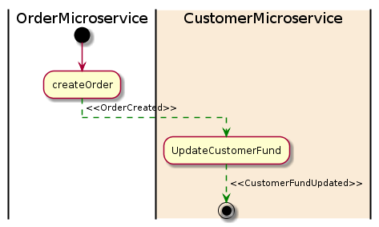
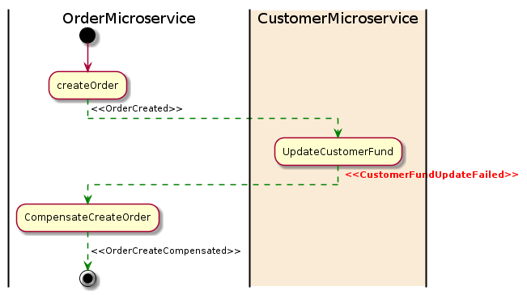
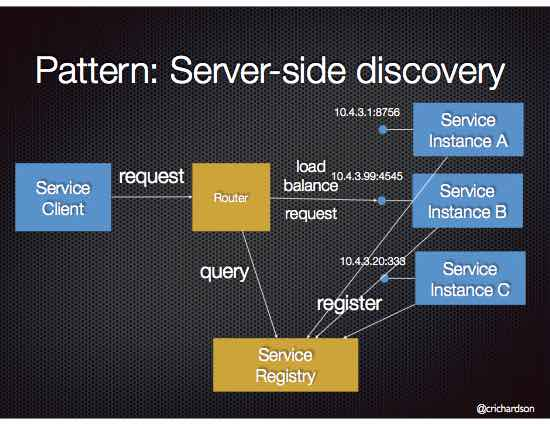

### What is Service-Oriented Architecture ?
Service-Oriented Architecture (SOA) is a stage in the evolution of application development and/or integration. It defines a way to make software components reusable using the interfaces.
Formally, SOA is an architectural approach in which applications make use of services available in the network. In this architecture, services are provided to form applications, through a network call over the internet. It uses common communication standards to speed up and streamline the service integrations in applications. Each service in SOA is a complete business function in itself. The services are published in such a way that it makes it easy for the developers to assemble their apps using those services. Note that SOA is different from microservice architecture.

SOA allows users to combine a large number of facilities from existing services to form applications.
SOA encompasses a set of design principles that structure system development and provide means for integrating components into a coherent and decentralized system.
SOA-based computing packages functionalities into a set of interoperable services, which can be integrated into different software systems belonging to separate business domains.
There are two major roles within Service-oriented Architecture:

### What does it mean to be cloud native?

Ever to the point, Wikipedia defines a native cloud app as, “a type of computer software that natively utilizes services and infrastructure from cloud computing providers such as Amazon EC2, Force.com, or Microsoft Azure.”

This is true. However, being cloud native actually encompasses a whole lot more than that. It’s not just a practical approach, but a mindset model. Being cloud native is more conceptual – it’s about embracing the immense potential in terms of scalability and flexibility that a cloud-based approach brings with it.

There are plenty of misconceptions around what it means to be cloud native. Perhaps you’ve heard that you need to use containers to be cloud native or to use AWS? Neither is necessary, though there are plenty of use cases where they make sense.

### What is 12-factor app design ?
1. Codebase
2. Dependencies
3. Config
4. Backing services
5. Build, release, run
6. Processes
7. Port binding
8. Concurrency
9. Disposability
10. Dev/prod parity
11. Logs
12. Admin processes
#
### What are microservices ?

Microservices architecture is the evolution of Services Oriented Architecture (SOA), and can be defined like "… an autonomous software service which is built to perform a single, specific, and granular task
The API Gateway is the entry point for a client, when a client request for a service the API Gateway receive the request and call the appropriated Microservice, decoupling the client and the services used in fact.

Microservices are small, independent, and loosely coupled. A single small team of developers can write and maintain a service.

Each service is a separate codebase, which can be managed by a small development team.

* **Services can be deployed independently.** A team can update an existing service without rebuilding and redeploying the entire application.
* **Services are responsible for persisting their own data or external state.** This differs from the traditional model, where a separate data layer handles data persistence.
* **Services communicate with each other by using well-defined APIs.** Internal implementation details of each service are hidden from other services.
* **Supports polyglot programming.** For example, services don't need to share the same technology stack, libraries, or frameworks.
* Besides for the services themselves, some other components appear in a typical microservices architecture:
* **Management/orchestration.** This component is responsible for placing services on nodes, identifying failures, rebalancing services across nodes, and so forth. Typically this component is an off-the-shelf technology such as Kubernetes, rather than something custom built.
* **API Gateway.** The API gateway is the entry point for clients. Instead of calling services directly, clients call the API gateway, which forwards the call to the appropriate services on the back end.

#### Advantages of using an API gateway include:
* **It decouples clients from services.** Services can be versioned or refactored without needing to update all of the clients.
Services can use messaging protocols that are not web friendly, such as AMQP.
* **The API Gateway can perform other cross-cutting functions** such as authentication, logging, SSL termination, and load balancing.
* **Out-of-the-box policies**, like for throttling, caching, transformation, or validation.

### Benefits
* **Agility.** Because microservices are deployed independently, it's easier to manage bug fixes and feature releases. You can update a service without redeploying the entire application, and roll back an update if something goes wrong. In many traditional applications, if a bug is found in one part of the application, it can block the entire release process. New features may be held up waiting for a bug fix to be integrated, tested, and published.
* **Small, focused teams.** A microservice should be small enough that a single feature team can build, test, and deploy it. Small team sizes promote greater agility. Large teams tend be less productive, because communication is slower, management overhead goes up, and agility diminishes.
* **Small code base.** In a monolithic application, there is a tendency over time for code dependencies to become tangled. Adding a new feature requires touching code in a lot of places. By not sharing code or data stores, a microservices architecture minimizes dependencies, and that makes it easier to add new features.
* **Mix of technologies.** Teams can pick the technology that best fits their service, using a mix of technology stacks as appropriate.
* **Fault isolation.** If an individual microservice becomes unavailable, it won't disrupt the entire application, as long as any upstream microservices are designed to handle faults correctly (for example, by implementing circuit breaking).
* **Scalability.** Services can be scaled independently, letting you scale out subsystems that require more resources, without scaling out the entire application. Using an orchestrator such as Kubernetes or Service Fabric, you can pack a higher density of services onto a single host, which allows for more efficient utilization of resources.
* **Data isolation.** It is much easier to perform schema updates, because only a single microservice is affected. In a monolithic application, schema updates can become very challenging, because different parts of the application may all touch the same data, making any alterations to the schema risky.

### Challenges
The benefits of microservices don't come for free. Here are some of the challenges to consider before embarking on a microservices architecture.

* **Complexity.** Microservice Application has more moving parts than the equivalent monolithic application. Each service is simpler, but the entire system as a whole is more complex.
* **Development and testing.** Writing a small service that relies on other dependent services requires a different approach than a writing a traditional monolithic or layered application. Existing tools are not always designed to work with service dependencies. Refactoring across service boundaries can be difficult. It is also challenging to test service dependencies, especially when the application is evolving quickly.
* **Lack of governance.** The decentralized approach to building microservices has advantages, but it can also lead to problems. You may end up with so many different languages and frameworks that the application becomes hard to maintain. It may be useful to put some project-wide standards in place, without overly restricting teams' flexibility. This especially applies to cross-cutting functionality such as logging.
* **Network congestion and latency.** The use of many small, granular services can result in more inter service communication. Also, if the chain of service dependencies gets too long (service A calls B, which calls C...), the additional latency can become a problem. You will need to design APIs carefully. Avoid overly chatty APIs, think about serialization formats, and look for places to use asynchronous communication patterns like queue-based load leveling.
* **Data Integrity.** With each microservice responsible for its own data persistence. As a result, data consistency can be a challenge. Embrace eventual consistency where possible.
* **Management.** To be successful with microservices requires a mature DevOps culture. Correlated logging across services can be challenging. Typically, logging must correlate multiple service calls for a single user operation.
* **Versioning.** Updates to a service must not break services that depend on it. Multiple services could be updated at any given time, so without careful design, you might have problems with backward or forward compatibility.
* **Skill Set.** Microservices are highly distributed systems. Carefully evaluate whether the team has the skills and experience to be successful.

### Best practices
Model services around the business domain.

Decentralize everything. Individual teams are responsible for designing and building services. Avoid sharing code or data schemas.

Data storage should be private to the service that owns the data. Use the best storage for each service and data type.

Services communicate through well-designed APIs. Avoid leaking implementation details. APIs should model the domain, not the internal implementation of the service.

Avoid coupling between services. Causes of coupling include shared database schemas and rigid communication protocols.

Offload cross-cutting concerns, such as authentication and SSL termination, to the gateway.

Keep domain knowledge out of the gateway. The gateway should handle and route client requests without any knowledge of the business rules or domain logic. Otherwise, the gateway becomes a dependency and can cause coupling between services.

Services should have loose coupling and high functional cohesion. Functions that are likely to change together should be packaged and deployed together. If they reside in separate services, those services end up being tightly coupled, because a change in one service will require updating the other service. Overly chatty communication between two services may be a symptom of tight coupling and low cohesion.

Isolate failures. Use resiliency strategies to prevent failures within a service from cascading. See Resiliency patterns and Designing reliable applications.

### What is a distributed transaction ?
When a Put Order request comes from the user, both microservices will be called to apply changes into their own database. Because the transaction is now across multiple databases, it is now considered a distributed transaction.

### What are Approaches for Microservice Transaction Management ?
* **2pc (two-phase commit)**
* **Saga**

### Explain Two-phase commit (2pc) pattern 
2pc has two phases: A prepare phase and a commit phase. In the prepare phase, all microservices will be asked to prepare for some data change that could be done atomically. Once all microservices are prepared, the commit phase will ask all the microservices to make the actual changes.
Normally, there needs to be a global coordinator to maintain the lifecycle of the transaction, and the coordinator will need to call the microservices in the prepare and commit phases.
Here is a 2pc implementation for the customer order example:

Here is a diagram of a 2pc rollback for the customer order example:

### Explain SAGA pattern 
The Saga pattern is another widely used pattern for distributed transactions. It is different from 2pc, which is synchronous. The Saga pattern is asynchronous and reactive. In a Saga pattern, the distributed transaction is fulfilled by asynchronous local transactions on all related microservices. The microservices communicate with each other through an event bus.
Here is a diagram of the Saga pattern for the customer order example:

In the above example, the UpdateCustomerFund failed for some reason and it then emitted a CustomerFundUpdateFailed event. The OrderMicroservice listens for the event and start its compensation transaction to revert the order that was created.

#### Advantages of the Saga pattern
One big advantage of the Saga pattern is its support for long-lived transactions. Because each microservice focuses only on its own local atomic transaction, other microservices are not blocked if a microservice is running for a long time. This also allows transactions to continue waiting for user input. Also, because all local transactions are happening in parallel, there is no lock on any object.

#### Disadvantages of the Saga pattern
The Saga pattern is difficult to debug, especially when many microservices are involved. Also, the event messages could become difficult to maintain if the system gets complex. Another disadvantage of the Saga pattern is it does not have read isolation. For example, the customer could see the order being created, but in the next second, the order is removed due to a compensation transaction.
Adding a process manager : To address the complexity issue of the Saga pattern, it is quite normal to add a process manager as an orchestrator. The process manager is responsible for listening to events and triggering endpoints.

### Tracing Micro Services

### API Gateway 
* Using an API gateway has the following benefits:
Insulates the clients from how the application is partitioned into microservices
Insulates the clients from the problem of determining the locations of service instances
Provides the optimal API for each client
Reduces the number of requests/roundtrips. For example, the API gateway enables clients to retrieve data from multiple services with a single round-trip. Fewer requests also means less overhead and improves the user experience. An API gateway is essential for mobile applications.
Simplifies the client by moving logic for calling multiple services from the client to API gateway
Translates from a “standard” public web-friendly API protocol to whatever protocols are used internally

* The API gateway pattern has some drawbacks:
Increased complexity - the API gateway is yet another moving part that must be developed, deployed and managed
Increased response time due to the additional network hop through the API gateway - however, for most applications the cost of an extra roundtrip is insignificant.
 
* Issues:
How implement the API gateway? An event-driven/reactive approach is best if it must scale to scale to handle high loads. On the JVM, NIO-based libraries such as Netty, Spring Reactor, etc. make sense. NodeJS is another option.

### Service Discovery
When making a request to a service, the client makes a request via a router (a.k.a load balancer) that runs at a well known location. The router queries a service registry, which might be built into the router, and forwards the request to an available service instance.
The following diagram shows the structure of this pattern.

### 