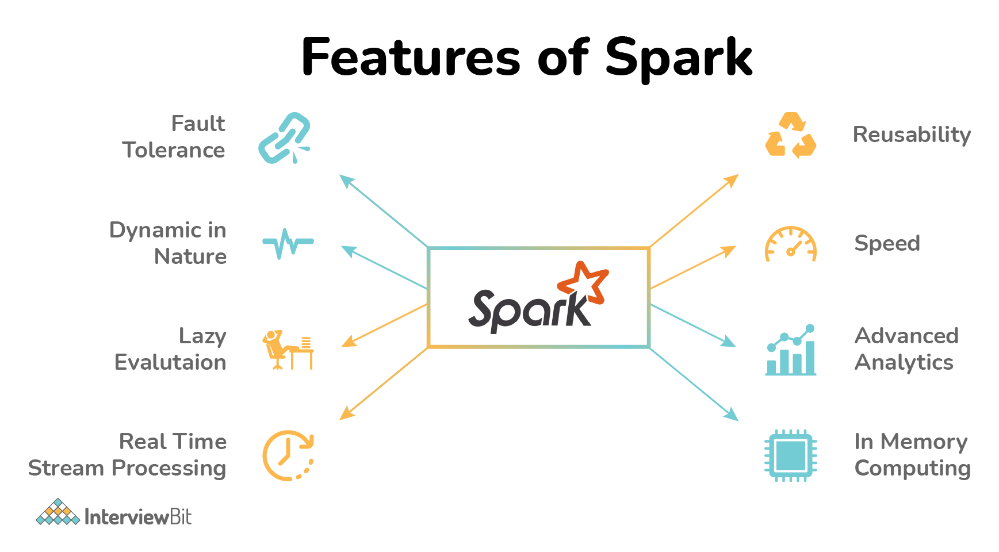
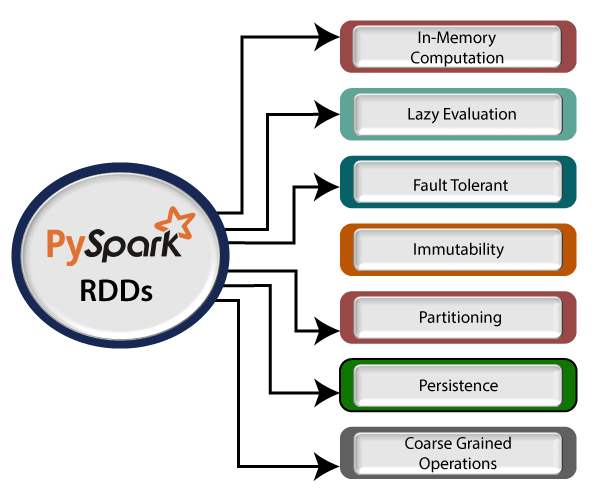
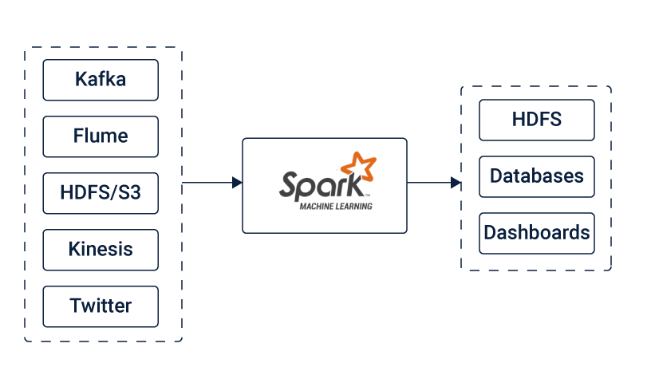
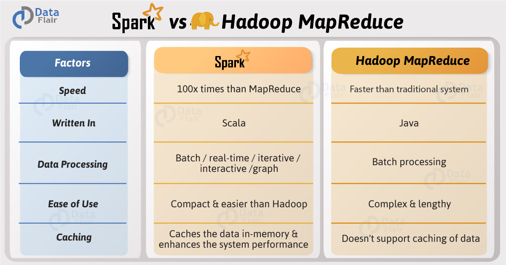
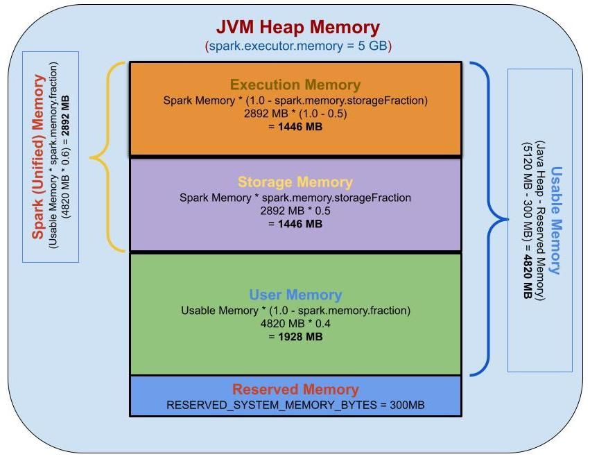
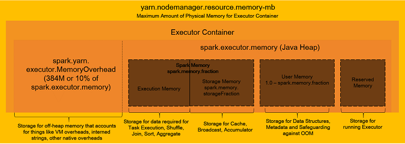
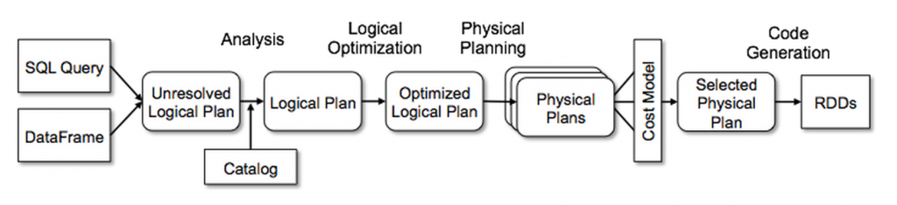
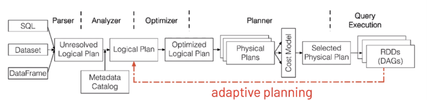

### Spark Features 


### What is `Resilient Distributed Dataset`  RDD ..?
An RDD is a collection of data which is partitioned, it is similar to a distributed collection. The more the number of partitions in an RDD, the more the parallelism. When a job runs, each partition will be moved to the node where it is going to be processed.

`Resilient Distributed Dataset` (RDD) is the fundamental data structure of Spark. They are immutable Distributed collections of objects of any type. As the name suggests is a Resilient (Fault-tolerant) records of data that resides on multiple nodes.
Each Dataset in Spark RDD is divided into logical partitions across the cluster and thus can be operated in parallel, on different nodes of the cluster. These RDDs can be created by deterministic operations on data on stable storage or other RDDs by either an existing Scala collection or with an external file in the HDFS(or any other supported file system). Users can opt to persist an RDD in memory so that it can be reused multiple times efficiently. RDDs also have the potential to recover from faults occurrences in the system automatically.



### What are wider transformations ..?


### 1. Suppose you have a spark dataframe which contains millions of records. You need to perform multiple actions on it. How will you minimize the execution time?
Answer : You can use cache or persist. For eg say you have dataframe df and if you use df1=df.cache() ,then df1 will be stored in its storage. once it is stored in its storage, multiple actions can be performed. Only first action will take longer time than others because on the first action, it actually caches the data. You can check the storage size of df1 from spark application tracker.

You can pass different storage level in persist.
Different storage levels are :
* MEMORY_ONLY
* MEMORY_ONLY_SER
* MEMORY_AND_DISK
* MEMORY_AND_DISK_SER
* DISK_ONLY
* OFF_HEAP

| Persistence Level   | Space Consumed    | CPU time	 | In-memory?     | On-disk? |
|:--------------------|:-----------------|:---------|:---------------|:-------------|
| MEMORY_ONLY 	       | High 	          | Low      | Yes	         | No            |
| MEMORY_ONLY_SER     | Low High         | Yes      | No            |               |
| MEMORY_AND_DISK     | High	          | Medium	 | Some	         | Some          |
| MEMORY_AND_DISK_SER | Low High         | Some     | Some          |               |
| DISK_ONLY           | Low High         | No       | Yes           |               |
| OFF_HEAP            | Low High         | Yes      | (but off-heap)| No            |


### 2. If your cluster have limited resources, and there are many applications which need to be run, how would you ensure that your spark application will take the fixed number of resource and hence does not impact execution of other applications?
Answer : While submitting the spark application pass these two parameters .
–num-executors 10
–conf spark.dynamicAllocation.enabled = false
Note: you can change the number of executors if you need.

### Key Feature of Spark Major Releases
* `Spark 1.x` – Introduced Catalyst Optimizer and Tungsten Execution Engine
* `Spark 2.x` – Added Cost-Based Optimizer
* `Spark 3.0` – Now added Adaptive Query Execution

### 3.How would you check if rdd is empty, without using collect?
Answer : You can use rdd.isEmpty ,it will return true if rdd is empty.

### 4. There is a json file with following content :-
{“dept_id”:101,”e_id”:[10101,10102,10103]}
{“dept_id”:102,”e_id”:[10201,10202]}

And data is loaded into spark dataframe say mydf, having below dtypes
dept_id: bigint, e_id: array<bigint>
What will be the best way to get the e_id individually with dept_id ?
Answer :
we can use the explode function , which will explode as per the number of items in e_id .
The code would be like
mydf.withColum(“e_id”,explode($”e_id”)).
Here we have taken the new column same as old column, the dtypes of opdf will be
dept_id: bigint, e_id:bigint
So output would look like
```commandline
+———------+——-----+
|  dept_id|  e_id |
+———------+----——-+
|  101    |  10101|
|  101    |  10102|
|  101    |  10103|
|  102    |  10201|
|  102    |  10202|
+———------+——-----+
```

### Q2 . How many number of column will be present in the df2, if df1 have three columns a1,a2,a3
```
var df2 = df.withColumn(“b1”,lit(“a1”))
            .withColumn(“a1”,lit(“a2”))
            .withColumn(“a2”,$“a2”)
            .withColumn(“b2”,$”a3”))
            .withColumn(“a3”,lit(“b1”))

Answer :
Total 5 As below
Df // a1,a2,a3
df.withColumn(“b1”,lit(“a1”)) //a1,a2,a3,b1
.withColumn(“a1”,lit(“a2”)) //a1,a2,a3,b1
.withColumn(“a2”,$“a2”) //a1,a2,a3,b1
.withColumn(“b2”,$”a3”))//a1,a2,a3,b1,b2
.withColumn(“a3”,lit(“b1”))//a1,a2,a3,b1,b2
```

###  Q3 . How to get RDD with its element indices.
Say myrdd = (a1,b1,c1,s2,s5)
Output should be ((a1,0),(b1,1),(c1,2),(s2,3),(s5,4))
Answer : we can use zipWithIndex function
```commandline
var myrdd_windx = myrdd.zipWithIndex()
```

### Q4. What is Spark Streaming?
Apache Spark Streaming is a scalable fault-tolerant streaming processing system that natively supports both batch and streaming workloads. Spark Streaming is an extension of the core Spark API that allows data engineers and data scientists to process real-time data from various sources including (but not limited to) Kafka, Flume, and Amazon Kinesis.
* Four Major Aspects of Spark Streaming
* Fast recovery from failures and stragglers
* Better load balancing and resource usage
* Combining of streaming data with static datasets and interactive queries
* Native integration with advanced processing libraries (SQL, machine learning, graph processing)


### Q. Explain Spark DStream
Spark Streaming is an extension of the core Spark API that enables scalable, high-throughput, fault-tolerant stream processing of live data streams. Data can be ingested from many sources like Kafka, Kinesis, or TCP sockets, and can be processed using complex algorithms expressed with high-level functions like map, reduce, join and window. Finally, processed data can be pushed out to filesystems, databases, and live dashboards. In fact, you can apply Spark’s machine learning and graph processing algorithms on data streams.


Internally, it works as follows. Spark Streaming receives live input data streams and divides the data into batches, which are then processed by the Spark engine to generate the final stream of results in batches.


### Q5. What is Spark Structured Streaming?
The key idea in Structured Streaming is to treat a live data stream as a table that is being continuously appended. This leads to a new stream processing model that is very similar to a batch processing model. You will express your streaming computation as standard batch-like query as on a static table, and Spark runs it as an incremental query on the unbounded input table. Let’s understand this model in more detail.


### Spark Functions

| Category	             | Functions                                                                                                                                                                                                                                                                                                                                                                                                                  |
|:----------------------|:---------------------------------------------------------------------------------------------------------------------------------------------------------------------------------------------------------------------------------------------------------------------------------------------------------------------------------------------------------------------------------------------------------------------------|
| Aggregate Functions	 | approxCountDistinct, avg, count, countDistinct, first, last, max, mean, min, sum, sumDistinct                                                                                                                                                                                                                                                                                                                              |
| Collection Functions	 | array_contains, explode, size, sort_array                                                                                                                                                                                                                                                                                                                                                                                  |
| Date/time Functions	 | Date/timestamp conversion: unix_timestamp, from_unixtime, to_date, quarter, day, dayofyear, weekofyear, from_utc_timestamp, to_utc_timestamp <br> Extracting fields from a date/timestamp value: year, month, dayofmonth, hour, minute, second <br> Date/timestamp calculation: datediff, date_add, date_sub, add_months, last_day, next_day, months_between <br>Misc.:current_date, current_timestamp, trunc, date_format |
| Math Functions	     | abs, acros, asin, atan, atan2, bin, cbrt, ceil, conv, cos, sosh, exp, expm1, factorial, floor, hex, hypot, log, log10, log1p, log2, pmod, pow, rint, round, shiftLeft, shiftRight, shiftRightUnsigned, signum, sin, sinh, sqrt, tan, tanh, toDegrees, toRadians, unhex                                                                                                                                                     |
| Misc. Functions	     | array, bitwiseNOT, callUDF, coalesce, crc32, greatest, if, inputFileName, isNaN, isnotnull, isnull, least, lit, md5, monotonicallyIncreasingId, nanvl, negate, not, rand, randn, sha, sha1, sparkPartitionId, struct, when                                                                                                                                                                                                 |
| String Functions	     | ascii, base64, concat, concat_ws, decode, encode, format_number, format_string, get_json_object, initcap, instr, length, levenshtein, locate, lower, lpad, ltrim, printf, regexp_extract, regexp_replace, repeat, reverse, rpad, rtrim, soundex, space, split, substring, substring_index, translate, trim, unbase64, upper                                                                                                |
| Window Functions      | (in addition to Aggregate Functions)	cumeDist, denseRank, lag, lead, ntile, percentRank, rank, rowNumber                                                                                                                                                                                                                                                                                                                   |

### Spark Performance Tuning : (Memory, Data Size,N/W Consumption)
#### Setup Side
* Data Serialization : Java Vs Kyro serialization 
* Memory Tuning : Driver & Executors Memory 
* Tuning Data Structure : FastUtil Collection Set
* Serialized RDD/DataFrame Persistence
* Garbage Collection Tuning : G1GC
* Right Level of Parallelism : 
* Use Broadcast Tables : 
* Data Locality : 
#### Programming Side
* Use DataFrame/Dataset over RDD
* Use coalesce() over repartition()
* Use mapPartitions() over map()
* Use Serialized data format’s
* Avoid UDF’s (User Defined Functions)
* Caching data in memory
* Reduce expensive Shuffle operations
* Disable DEBUG & INFO Logging

### Project Tungsten
Spark Dataset/DataFrame includes Project Tungsten which optimizes Spark jobs for Memory and CPU efficiency. Tungsten is a Spark SQL component that provides increased performance by rewriting Spark operations in bytecode, at runtime. Tungsten performance by focusing on jobs close to bare metal CPU and memory efficiency.

Since DataFrame is a column format that contains additional metadata, hence Spark can perform certain optimizations on a query. Before your query is run, a logical plan is created using Catalyst Optimizer and then it’s executed using the Tungsten execution engine.

### What is Catalyst?
Catalyst Optimizer is an integrated query optimizer and execution scheduler for Spark Datasets/DataFrame. Catalyst Optimizer is the place where Spark tends to improve the speed of your code execution by logically improving it.

Catalyst Optimizer can perform refactoring complex queries and decides the order of your query execution by creating a rule-based and code-based optimization.

Additionally, if you want type safety at compile time prefer using Dataset. For example, if you refer to a field that doesn’t exist in your code, Dataset generates compile-time error whereas DataFrame compiles fine but returns an error during run-time.

### Why Spark over Hadoop ..?


### Explain Spark Memory Model
* reserve memory 300mb
* user space memory (1 - spark.memory.fraction) * total memory == 0.4 * total memory
* spark.memory.fraction = 0.6
* spark.memory.storageFraction = 0.5
* spark.memory.executionFraction = 0.5


### Explain Spark Yarn Memory Model


### Spark SQL Optimization 


### Explain Spark Adaptive Query Plan 
Spark SQL adapts the execution plan at runtime, such as automatically setting the number of reducers and join algorithms.
Adaptive Query Execution (AQE) is an optimization technique in Spark SQL that makes use of the runtime statistics to choose the most efficient query execution plan, which is enabled by default since Apache Spark 3.2.0. Spark SQL can turn on and off AQE by spark.sql.adaptive.enabled as an umbrella configuration. As of Spark 3.0, there are three major features in AQE: including coalescing post-shuffle partitions, converting sort-merge join to broadcast join, and skew join optimization.

* Coalescing Post Shuffle Partitions
* Converting sort-merge join to broadcast join
* Converting sort-merge join to shuffled hash join
* Optimizing Skew Join



###  How do I resolve the error Container killed by YARN for exceeding memory limits in Spark on YARN?
* Increase Memory Overhead (Memory overhead is the amount of off-heap memory allocation to each executor)
  keep in mind that total `executor/driver` memory should be less than < Yarn container memory
  spark.executor.memory + spark.executor.memoryOverhead < yarn.resourcemanager.resource.memory--mb
* Reduce number of Executor cores
* Increase Number of Partitions
* Increase Driver & Executor memory

### Explain Dynamic Resource Allocation OR  How you manage different size of workload in spark. 
Spark provides a mechanism to dynamically adjust the resources your application occupies based on the workload. This means that your application may give resources back to the cluster if they are no longer used and request them again later when there is demand. This feature is particularly useful if multiple applications share resources in your Spark cluster.
This feature is disabled by default and available on all coarse-grained cluster managers, i.e. standalone mode, YARN mode, Mesos coarse-grained mode and K8s mode.
```
spark-submit --master yarn-cluster \
# spark.yarn.am.cores (client)
# spark.driver.cores (cluster)
--driver-cores 2 \
--driver-memory 2G \
--num-executors 10 \
# spark.executor.cores
--executor-cores 5 \
--executor-memory 2G \
# spark.yarn.queue
--queue thequeue \
# Dynamic Resource Allocation
--conf spark.dynamicAllocation.enabled
--conf spark.dynamicAllocation.shuffleTracking.enabled
--conf spark.dynamicAllocation.minExecutors=5 \
--conf spark.dynamicAllocation.maxExecutors=30 \
--conf spark.dynamicAllocation.initialExecutors=10 \ # same as --num-executors 10
#
--conf spark.yarn.dist.jars
--conf spark.yarn.archive
--conf spark.yarn.dist.files
--class com.spark.sql.jdbc.SparkDFtoOracle2 \
spark-hive-sql-application.jar
```
